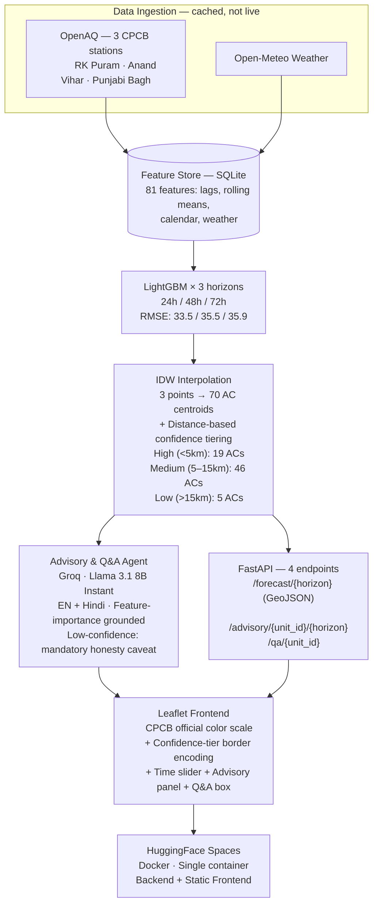

# 🌫️ VayuDrishti — Hyperlocal AQI Intelligence

**Constituency-level, 72-hour, explainable air quality forecasting for Delhi — built on real government ground-station data and weather measurements, at zero infrastructure cost.**

[Live Demo](https://ogrohit-vayudrishti.hf.space) · [GitHub](https://github.com/rohitdecodes/VayuDrishti)


---

## 📑 Table of Contents

- [Short Description](#-short-description)
- [Problem Statement](#-problem-statement)
- [Why This Problem Matters](#-why-this-problem-matters)
- [Our Solution](#-our-solution)
- [Key Features](#-key-features)
- [Innovation](#-innovation)
- [System Architecture](#-system-architecture)
- [Technology Stack](#-technology-stack)
- [Data Sources](#-data-sources)
- [Directory Structure](#-directory-structure)
- [How the System Works](#-how-the-system-works)
- [Evaluation Metrics](#-evaluation-metrics)
- [Known Limitations](#-known-limitations)
- [Installation & Setup](#-installation--setup)
- [Business Impact & Scalability](#-business-impact--scalability)
- [Contributors](#-contributors)
- [License](#-license)
- [Acknowledgements](#-acknowledgements)

---

## 📝 Short Description

VayuDrishti is a **hyperlocal, explainable AQI forecasting system** for Delhi. It uses 3 active CPCB ground-station sensors (via OpenAQ) and weather data to produce **24h / 48h / 72h constituency-level AQI forecasts** across 70 Delhi Assembly Constituencies, with an **explicit confidence-tier overlay** (High/Medium/Low based on distance from nearest station). A thin, honest LLM layer translates the numbers into plain-language advisories in English and Hindi — grounded strictly in the model's real feature importances, never hallucinating from data the model never saw.

Every data source in the trained model is real, live, and free. Satellite and fire data are not in the model — this is stated plainly everywhere, including in the model's own advisory responses.

---

## ❓ Problem Statement

**PS5 — Urban Air Quality Intelligence** asks for an AI-driven system that turns India's existing air-quality monitoring infrastructure (900+ CAAQMS stations, satellite feeds, weather data) into actionable intelligence.

Our scoped build deliberately does *not* attempt every suggested component. Instead, we build the one hard, load-bearing piece those components would all depend on — an honest, benchmarked, constituency-level forecast — and do it right. See [Known Limitations](#-known-limitations) for exactly what's out of scope.

---

## 💡 Why This Problem Matters

- **1.67 million premature deaths per year** in India are linked to air pollution *(Lancet Planetary Health)*.
- Only **31% of cities** with CPCB monitoring data have any actionable, multi-agency response protocol *(2024 CAG audit)*.
- **900+ CAAQMS stations** are already deployed nationally — the data exists. Nobody built the layer that turns it into a warning before conditions get bad.

---

## 🚀 Our Solution

A **Hyperlocal Predictive AQI Forecasting Agent** for Delhi (highest CAAQMS station density in India), producing 24h/48h/72h constituency-level AQI forecasts from ground-station and meteorological data — presented on an interactive map, with an LLM layer that:

1. Translates the numeric forecast into a plain-language, localized (English + Hindi) health advisory.
2. Answers follow-up questions about *why* a specific constituency's forecast is moving — grounded in the model's own real feature importances, never a hallucinated explanation.

**Demo boundary:** shows what AQI will be at constituency level over the next 3 days in one city, and explains why in plain language. No enforcement recommendations, no multi-city view, no live citizen delivery channel.

---

## ✨ Key Features

- 📍 **72-hour, constituency-level AQI forecasts** — interpolated surface from 3 active CPCB stations across 70 Delhi Assembly Constituencies, labeled honestly as "constituency-level" (not ward-level).
- 🎯 **Confidence-tier overlay (High/Medium/Low)** — every forecast is tagged with a distance-based confidence tier (High <5km, Medium 5–15km, Low >15km from nearest station). Low-confidence units show an explicit honesty caveat on both the map and in advisory text.
- 📊 **Two honest baselines** — persistence ("tomorrow = today") and seasonal-naive ("same hour last week"), with RMSE compared transparently.
- 🗣️ **Bilingual (EN/HI) plain-language advisory** — grounded in the forecast, not generic text. Low-confidence advisories state plainly: "This estimate is far from our monitoring stations — treat it as directional only."
- 🤖 **Grounded Q&A** — "why is this constituency's AQI rising?" is answered using the model's *actual* feature importances. The agent never references satellite or fire data because they were never in the trained model.
- 🎨 **Official CPCB AQI color scale** — exact government-defined hex values for all six AQI categories.
- 🔒 **Fully cached data pipeline** — ingestion runs offline. The Groq advisory/Q&A calls are intentionally live for the interactive moment, backed by pre-generated fallback responses.
- 💸 **Zero-cost, end-to-end** — every tool and data source has a genuine free tier.

---

## 🧠 Innovation

The novelty is three things together: **(1)** an **honest confidence-tier overlay** that tells you exactly how far each forecast is from a real sensor, because interpolating 3 stations across 70 constituencies deserves that transparency; **(2)** a real ML forecast feeding an LLM that **doesn't hallucinate** but reasons over the model's own feature importances; and **(3)** a model that **knows what it doesn't know** — asked about satellite or fire data, it tells you plainly those aren't in this model. Most AQI projects stop at "a number on a map." This one turns the number into an honest, interrogable conversation.

---

## 🏗 System Architecture



**Where AI is used vs. classical processing:** the numeric forecast is a **classical gradient-boosting regression model** — the right tool for numerical prediction. The LLM's job is narrow: translate model output into plain language and answer questions using real feature importances. This division of labour is deliberate, not a limitation.

**Agents, honestly described:** there are two — a **Forecasting Agent** (scheduled ML inference) and an **Advisory & Q&A Agent** (LLM). Naming two well-built components plainly reads better than overclaiming complexity that wasn't built.

---

## 🛠 Technology Stack

| Layer | Choice | Why |
|---|---|---|
| **Frontend** | Leaflet.js 1.9 + CartoDB dark tiles | Zero API key, looks polished out of the box |
| **Backend** | Python 3.11 + FastAPI | Lightweight API layer with built-in OpenAPI docs |
| **Machine Learning** | LightGBM 4.x | Gradient-boosted trees are pragmatic for fused tabular features; trains in minutes on a laptop CPU |
| **Spatial Interpolation** | IDW (Inverse Distance Weighting) + confidence-tier overlay | 3 station points → 70 AC centroids, explicitly labeled by distance confidence |
| **LLM** | Groq — `llama-3.1-8b-instant` | Fast (<1s), free-tier friendly, constrained prompt to real features |
| **Database** | SQLite | Zero-setup single-file feature store |
| **Deployment** | HuggingFace Spaces (Docker) | Free CPU tier, single-container backend + static frontend |

---

## 🌐 Data Sources

| Source | In Current Model? |
|---|---|
| **OpenAQ** (3 CPCB stations: RK Puram, Anand Vihar, Punjabi Bagh) | ✅ Yes — 121K+ measurements, 91 days of PM2.5/PM10/NO2/SO2/CO/O3 |
| **Open-Meteo** (temperature, humidity, pressure, wind) | ✅ Yes — joined on station + timestamp |
| **WAQI** (CPCB mirror) | ⬜ Historical only, not in model features |
| **Sentinel-5P via GEE** (NO2 column, aerosol optical depth) | ❌ Not in model — GEE IAM pending |
| **NASA FIRMS** (fire detections) | ❌ Not in model — zero detections in sample window |

The trained model uses **only** ground-station sensor readings, weather measurements, temporal lags, rolling averages, and calendar features. The Advisory and Q&A agent is explicitly constrained: if asked about satellite or fire data, it states: *"Our current model is built on ground-station data and weather measurements only. Satellite and fire data are not part of this model."*

---

## 📂 Directory Structure

```
vayudrishti/
├── data/
│   ├── raw/                        # cached raw pulls (gitignored)
│   ├── processed/                  # joined feature tables
│   └── boundaries/                 # Delhi Assembly Constituency GeoJSON (70 ACs)
├── ingestion/                      # data pull clients (run once, not live)
├── features/                       # feature engineering pipeline
├── models/                         # trained LightGBM .pkl + metadata
├── interpolation/                  # IDW + confidence tiering
├── agents/                         # Advisory & Q&A Agent (Groq)
├── backend/                        # FastAPI (4 endpoints + static frontend)
├── frontend/                       # Leaflet dashboard (single HTML file)
├── config/                         # interpolation thresholds, settings
├── docs/                           # architecture diagram
├── Dockerfile
├── requirements.txt
└── README.md
```

---

## ⚙️ How the System Works

**Data Pipeline** — OpenAQ (real CPCB) and Open-Meteo weather data are pulled once, joined on station-location + timestamp, and cached in SQLite. This never runs live during the demo.

**Prediction Pipeline** — Feature engineering builds lags (t-1 through t-72h), rolling averages, and calendar flags. Three separate LightGBM models predict AQI at 24h/48h/72h per station, benchmarked against persistence and seasonal-naive baselines. IDW interpolation then turns 3 station points into 70 constituency-level estimates, with a distance-based confidence overlay.

**LLM Workflow** — The Advisory Agent takes `{constituency, forecast AQI, category, confidence tier, top real feature importances}` and produces a 2–3 sentence advisory in English + Hindi via Groq. Low-confidence units automatically trigger an honesty caveat. The Q&A Agent answers follow-up questions using the model's actual top features, constrained to never reference satellite or fire data.

**User Workflow** — Open the dashboard → see a color-coded constituency map with confidence borders → move the time slider (24h / 48h / 72h) → click a constituency → read the localized advisory in EN + Hindi → optionally type a follow-up question.

---

## 📊 Evaluation Metrics

The model is evaluated against two baselines on a held-out chronological validation split:

| Horizon | Model RMSE | Persistence | Seasonal-Naive |
|---------|-----------|-------------|----------------|
| 24h | **33.47** | 42.82 | 46.63 |
| 48h | **35.53** | 50.65 | 43.11 |
| 72h | **35.88** | 47.65 | 36.34 |

The model beats persistence at all three horizons. At 72h, the seasonal-naive baseline narrows the gap — expected given the longer forecast range — and is framed honestly as directional.

---

## 🚧 Known Limitations

- **Single city (Delhi) only** at current stage.
- **Only 3 active monitoring stations** — the other 5 Delhi CPCB stations dropped out of OpenAQ around 2018. IDW from 3 points across 70 constituencies is an approximation, which is exactly why the confidence-tier overlay is mandatory, not cosmetic.
- **Constituency-level, not ward-level** — boundaries are Delhi Assembly Constituencies (~70 units), not MCD wards (~250). Every UI label states "constituency-level" honestly.
- **No satellite or fire features** — GEE IAM is pending. The Advisory/Q&A agent is explicitly constrained and tells users plainly when asked.
- **Advisory grounded in feature importances, not causal attribution** — directional, never claimed as causal.
- **No enforcement recommendations or citizen delivery channels** — advisory is in-dashboard only at this stage.

---

## 🔧 Installation & Setup

### Prerequisites

- Python 3.11+
- [HuggingFace account](https://huggingface.co) (for deployment)
- Free API key: [Groq](https://console.groq.com) (required for live advisory/Q&A)

### Environment Variables

Create a `.env` file:

```env
GROQ_API_KEY=your_groq_key_here
```

**Only `GROQ_API_KEY` is required to run the deployed app.** The other keys listed in `.env.example` (`WAQI_TOKEN`, `DATA_GOV_IN_API_KEY`, etc.) were used for the one-time historical data pull during development — the live API does not need them.

### Running Locally

```bash
git clone https://github.com/rohitdecodes/VayuDrishti.git
cd VayuDrishti
python -m venv venv && source venv/bin/activate
pip install -r requirements.txt

uvicorn backend.main:app --reload
```

Then open `http://localhost:8000` in a browser. The FastAPI app serves both the API and the Leaflet dashboard.

### Deployment (HuggingFace Spaces)

1. Create a [HuggingFace Space](https://huggingface.co/new-space?sdk=docker) with the **Docker** SDK.
2. Add `GROQ_API_KEY` as a **Space repository secret** (Settings → Repository secrets) — never commit it.
3. Push this repo. The Space auto-builds from the `Dockerfile`.

---

## 💼 Business Impact & Scalability

India has already built and paid for 900+ government air-quality sensors. VayuDrishti is the missing layer that turns that existing infrastructure into 72-hour, constituency-level, actionable warnings — instead of a number on a dashboard nobody consults — at zero additional data-collection cost.

The architecture is designed to scale: swapping to a new city is a matter of providing a new station list and boundary GeoJSON. The stateless FastAPI backend scales horizontally behind a load balancer. The confidence-tier approach makes the interpolation honesty portable — it works the same way whether you have 3 stations or 300.

---

## 👤 Contributors

**Rohit Patil** — Solo Builder · B.Tech IT, Walchand College of Engineering, Sangli · [GitHub: rohitdecodes](https://github.com/rohitdecodes)

---

## 📄 License

MIT License — permissive, standard for open-source submissions.

---

## 🙏 Acknowledgements

OpenAQ · Open-Meteo · OpenStreetMap/CartoDB · Groq · HuggingFace Spaces · Economic Times AI Hackathon 2026 organizers.

---

*Detailed build history and verification logs are available in [PHASE_1.md](PHASE_1.md), [PHASE_2.md](PHASE_2.md), and [PHASE_3.md](PHASE_3.md). The demo rehearsal script was moved to [DEMO_SCRIPT.md](DEMO_SCRIPT.md).*
