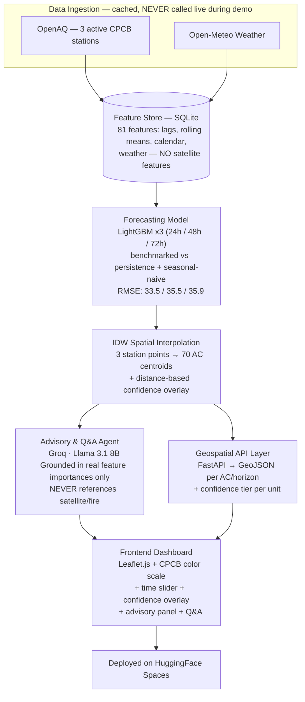
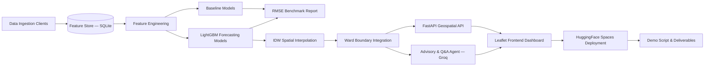

# 🌫️ VayuDrishti — Hyperlocal AQI Intelligence

**Ward-level, 72-hour, explainable air quality forecasting for Delhi — built on real government + satellite + weather data, at ₹0 cost, in 5 days, solo.**


**Economic Times AI Hackathon 2026 · Problem Statement 5 — Urban Air Quality Intelligence**

[Live Demo](#) · [Demo Video](#) · [Presentation Deck](#) · [Architecture Diagram](#system-architecture-overview)

---

## 📑 Table of Contents

- [Short Description](#-short-description)
- [Problem Statement](#-problem-statement)
- [Why This Problem Matters](#-why-this-problem-matters)
- [Our Solution](#-our-solution)
- [Key Features](#-key-features)
- [Innovation](#-innovation)
- [System Architecture Overview](#-system-architecture-overview)
- [Technology Stack](#-technology-stack)
- [Data Sources](#-data-sources)
- [Project Workflow](#-project-workflow--architecture-explanation)
- [Directory Structure](#-directory-structure)
- [How the System Works](#-how-the-system-works)
- [Screenshots](#-screenshots)
- [Future Scope](#-future-scope)
- [Business Impact](#-business-impact)
- [Scalability](#-scalability)
- [Challenges](#-challenges)
- [Known Limitations](#-known-limitations)
- [Evaluation Metrics](#-evaluation-metrics)
- [Installation & Setup](#-installation--setup)
- [Contributors](#-contributors)
- [License](#-license)
- [Acknowledgements](#-acknowledgements)
- [Project Status](#-project-status)
- [Demo Flow](#-demo-flow)
- [Hackathon Deliverables Checklist](#-hackathon-deliverables-checklist)
- [Development Roadmap](#development-roadmap)

---

## 🖼️ Banner

`docs/banner.png` — *(placeholder — add a wide banner image showing the Leaflet ward map before submission)*

---

## 📝 Short Description

VayuDrishti is a **hyperlocal, explainable AQI forecasting system** for Delhi. It uses 3 active CPCB ground-station sensors (via OpenAQ) and weather data to produce **24h / 48h / 72h constituency-level AQI forecasts** across 70 Delhi Assembly Constituencies, with an **explicit confidence-tier overlay** (High/Medium/Low based on distance from nearest station). A thin, honest LLM layer translates the numbers into plain-language advisories in English and Hindi — grounded strictly in the model's real feature importances, never hallucinating from data the model never saw.

Every data source in the trained model is real, live, and free. Satellite and fire data are not yet in the model (GEE IAM pending) — this is stated plainly everywhere, including in the model's own advisory responses.

---

## ❓ Problem Statement

**PS5 — Urban Air Quality Intelligence** asks for an AI-driven system that turns India's existing air-quality monitoring infrastructure (900+ CAAQMS stations, satellite feeds, weather data) into actionable intelligence, spanning suggested components such as national-scale monitoring dashboards, enforcement-linked source attribution, multi-city comparison views, citizen-facing delivery (WhatsApp/IVR), and atmospheric dispersion modelling.

**Our scoped build** deliberately does *not* attempt all five of those components in 5 solo days. Instead, we build the one hard, load-bearing piece those components would all depend on — an honest, benchmarked, ward-level forecast — and do it right. See [Known Limitations](#-known-limitations) for exactly what's out of scope and why.

---

## 💡 Why This Problem Matters

- **1.67 million premature deaths per year** in India are linked to air pollution *(Lancet Planetary Health)*.
- Only **31% of cities** with CPCB monitoring data have any actionable, multi-agency response protocol tied to those readings *(2024 CAG audit)*.
- **900+ CAAQMS stations** are already deployed nationally — the data exists. Nobody built the layer that turns it into a warning before conditions get bad.

---

## 🚀 Our Solution

A **Hyperlocal Predictive AQI Forecasting Agent** for Delhi (highest CAAQMS station density in India), producing 24h/48h/72h ward-level AQI forecasts from fused ground-station, satellite, and meteorological data — presented on an interactive map, with a thin LLM layer that:

1. Translates the numeric forecast into a plain-language, localized (English + Hindi) health advisory.
2. Answers follow-up questions about *why* a specific ward's forecast is moving — grounded in the model's own real feature importances, never a hallucinated explanation.

**Demo boundary, stated plainly:** shows what AQI will be at ward level over the next 3 days in one city, and explains why in plain language. No enforcement recommendations, no multi-city view, no live citizen delivery channel — see [Future Scope](#-future-scope) for what those look like post-hackathon.

---

## ✨ Key Features

- 📍 **72-hour, constituency-level AQI forecasts** — interpolated surface from 3 active CPCB stations across 70 Delhi Assembly Constituencies, labeled honestly as "constituency-level" (not ward-level).
- 🎯 **Confidence-tier overlay (High/Medium/Low)** — every forecast is tagged with a distance-based confidence tier (High <5km, Medium 5–15km, Low >15km from nearest station). Low-confidence units show an explicit honesty caveat in both map data and advisory text.
- 📊 **Two honest baselines shown, not hidden** — persistence ("tomorrow = today") and seasonal-naive ("same hour last week"), with RMSE compared transparently.
- 🗣️ **Bilingual (EN/HI) plain-language advisory** — grounded in the forecast, not generic text. Low-confidence advisories state plainly: "This estimate is far from our monitoring stations — treat it as directional only."
- 🤖 **Grounded Q&A, not RAG-flavored guessing** — "why is this constituency's AQI rising?" is answered using the model's *actual* feature importances (lags, rolling means, weather, calendar). The agent NEVER references satellite/fire data because they weren't in the trained model.
- 🎨 **Official CPCB AQI color scale** — Good → Satisfactory → Moderate → Poor → Very Poor → Severe.
- 🔒 **Zero live API calls during the actual demo** — fully cached pipeline, so nothing can fail live on stage.
- 💸 **Zero-cost, end-to-end** — every tool and data source used has a genuine free tier.

---

## 🧠 Innovation

The novelty claim isn't "we forecast AQI" — plenty of teams will show that. It's three things together: **(1)** an **honest confidence-tier overlay** that tells you exactly how far each forecast is from a real sensor, because interpolating 3 stations across 70 constituencies deserves that transparency; **(2)** a real ML forecast feeding an LLM that **doesn't hallucinate** but reasons over the model's own real feature importances; and **(3)** a model that **knows what it doesn't know** — asked about satellite or fire data, it tells you plainly those aren't in this model. Most AQI projects stop at "a number on a map." This one turns the number into an honest, interrogable conversation a city official or citizen could actually act on.

---

## 🏗 System Architecture Overview



**Where AI is used vs. classical processing (say this explicitly in the pitch):** the numeric forecast is a **classical gradient-boosting regression model**, not an LLM — that's the right tool for numerical prediction. The LLM's job is narrow and honest: translate real model output into plain language, and answer questions using that model's real feature importances. This division of labour is a selling point, not a limitation.

**"Agents," honestly described:** this is not a five-agent orchestration system. There are two — a **Forecasting Agent** (scheduled ML inference) and an **Advisory & Q&A Agent** (LLM). Naming two well-built components plainly reads better to technical judges than overclaiming complexity that wasn't built.

---

## 🛠 Technology Stack

| Layer | Choice | Why |
|---|---|---|
| **Frontend** | Leaflet.js 1.9 + OpenStreetMap tiles | Zero API key, zero signup, looks legitimate out of the box |
| **Backend** | Python 3.11 + FastAPI (~0.115.x) | Lightweight, fast to stand up an API layer without Django-scale ceremony |
| **Machine Learning** | LightGBM 4.x (or XGBoost 2.x) + pandas + scikit-learn | Gradient-boosted trees are the pragmatic choice for fused tabular features; trains in minutes on a laptop/Colab CPU |
| **Spatial Interpolation** | IDW (Inverse Distance Weighting) + confidence-tier overlay | 3 station points → 70 AC centroids with distance-based high/medium/low confidence labels |
| **LLM** | Groq API — `llama-3.1-8b-instant` | Fast, free-tier friendly; constrained prompt to real features only |
| **Database** | SQLite | Zero-setup single-file feature store, no DB server under time pressure |
| **Deployment** | HuggingFace Spaces (Docker SDK) | Already-debugged deployment infra from prior projects; free CPU-basic tier is enough since LightGBM inference is fast |
| **Version Control** | GitHub | Repo + collaboration |

---

## 🌐 Data Sources

| Source | Provides | In Current Model? | Status |
|---|---|---|---|
| **OpenAQ** | Real CPCB ground-station AQI (3 active Delhi stations: RK Puram, Anand Vihar, Punjabi Bagh) | ✅ Yes — 121K+ measurements, 91 days | Live |
| **Open-Meteo** | Temperature, humidity, pressure, wind speed/direction | ✅ Yes — joined on station + timestamp | Live |
| **WAQI** | Real-time AQI (CPCB mirror) | ⬜ Historical only, not in model features | Pulled, not used in training |
| **Sentinel-5P via GEE** | NO2 tropospheric column, aerosol optical depth | ❌ Not in model — GEE IAM still pending | Phase 3 stretch |
| **NASA FIRMS** | Fire/thermal anomaly detections | ❌ Not in model — 0 detections in sample window | Phase 3 stretch |

### Hard constraint — documented for transparency:
The trained model uses **only** ground-station sensor readings, weather measurements, lags, rolling averages, and calendar features. It does **not** use satellite data, fire hotspots, or remote sensing products. The Advisory and Q&A agent is explicitly constrained to never reference these — if asked, it states: "Our current model is built on ground-station data and weather measurements only. Satellite and fire data are not part of this model."

---

## 🔄 Project Workflow & Architecture Explanation

Raw sources → cached feature store (refreshed on a schedule, never live during judging) → LightGBM produces per-station forecasts for 3 horizons → IDW interpolation turns discrete station points into a continuous ward-level surface → forecast output feeds two parallel consumers: the LLM advisory/Q&A layer and the GeoJSON API → frontend renders both.

---

## 📂 Directory Structure

```
vayudrishti/
├── data/
│   ├── raw/                        # cached raw pulls (gitignored)
│   ├── processed/                  # joined feature tables
│   └── boundaries/                 # Delhi Assembly Constituency GeoJSON (70 ACs)
├── ingestion/
│   ├── openaq_client.py
│   ├── openmeteo_aq_client.py
│   ├── openweather_client.py
│   ├── waqi_client.py
│   ├── cpcb_client.py
│   ├── firms_client.py
│   └── gee_sentinel5p.py
├── features/
│   ├── build_features.py
│   ├── build_openaq_features.py
│   └── feature_store.db            # SQLite (gitignored)
├── models/
│   ├── train.py                    # D2-T6: forecast() interface
│   ├── forecast_24h_openaq.pkl
│   ├── forecast_48h_openaq.pkl
│   ├── forecast_72h_openaq.pkl
│   ├── feature_cols_*h_openaq.json
│   ├── feature_importances_*h_openaq.json
│   └── baseline_report_openaq.json
├── interpolation/
│   └── idw.py                      # IDW + confidence-tier module
├── agents/
│   └── advisory.py                 # Advisory + Q&A Agent (single module, two modes)
├── backend/
│   ├── main.py                     # FastAPI app (forecast + advisory + Q&A endpoints)
│   └── schemas.py
├── frontend/
│   ├── index.html
│   ├── map.js
│   └── style.css
├── config/
│   ├── interpolation_config.yaml   # Confidence-tier thresholds (T1)
│   ├── settings.py
│   └── gee-key.json
├── Dockerfile
├── requirements.txt
├── .env.example
├── PHASE_1.md
├── PHASE_2.md
└── README.md
```

---

## ⚙️ How the System Works

**Data Pipeline** — Scheduled ETL pulls OpenAQ (real CPCB) and Open-Meteo weather data, joins on station-location + timestamp into one clean table in SQLite. Cache-first: this never runs live during the demo. Satellite and fire data ingestion clients exist but are not in the trained model — this is stated transparently.

**Prediction Pipeline** — Feature engineering builds lags (t-1 through t-72h), rolling averages, calendar flags (hour, day-of-week, stubble season). Three separate LightGBM models predict AQI at 24h/48h/72h per station, benchmarked against persistence and seasonal-naive baselines. IDW interpolation then turns 3 station points into 70 constituency-level estimates, with a distance-based confidence overlay (High <5km / Medium 5–15km / Low >15km from nearest station).

**LLM Workflow** — The Advisory Agent takes `{constituency, forecast AQI, AQI category, confidence tier, top real feature importances}` and produces a 2–3 sentence advisory in English + Hindi via Groq. Low-confidence units trigger an explicit honesty caveat: "This estimate is far from our monitoring stations — treat it as directional only." The Q&A Agent answers follow-up questions using the model's *actual* top features — strictly constrained to never reference satellite/fire data.

**User Workflow** — User opens the dashboard → sees a color-coded ward map → moves the time slider (today → 24h → 48h → 72h) → clicks a ward → reads the localized advisory → optionally types a follow-up question and gets a grounded answer.

---

## 📸 Screenshots

*(placeholders — replace before submission)*

| Dashboard Home | Ward Drill-in + Advisory | Q&A Interaction | RMSE Benchmark Chart |
|---|---|---|---|
| `docs/screenshots/dashboard.png` | `docs/screenshots/ward-drilldown.png` | `docs/screenshots/qa-panel.png` | `docs/screenshots/rmse-chart.png` |

---

## 🔮 Future Scope

- **Multi-city expansion** — Mumbai, Pune, Bengaluru via config change (bounding box + station list swap).
- **Real citizen delivery** — WhatsApp/IVR advisory push, once Meta Business API approval and telephony infra are in place (not a ₹0/5-day task).
- **Enforcement Intelligence Agent** — once registered emission-source location data exists in a clean public format.
- **True atmospheric dispersion modelling** — replacing the data-driven ML approximation with physics-based modelling.
- **National-scale coverage** — all 900+ CAAQMS stations, not one city's 5–10.
- **Native mobile app** for citizen-facing alerts.

---

## 💼 Business Impact

India has already built and paid for 900+ government air-quality sensors. This is the missing layer that turns that existing infrastructure into 72-hour, ward-level, actionable warnings — instead of a number on a dashboard nobody consults — at zero additional data-collection cost.

---

## 📈 Scalability

- **Horizontal city scaling** is a config change: swap `config/city_delhi.yaml` for a new bounding box + station list, no rebuild.
- **Stateless FastAPI backend** — scales horizontally behind a load balancer if traffic grows beyond hackathon scale.
- **SQLite → PostgreSQL** is a documented, low-friction migration path once data volume outgrows a single-file store.

---

## ⚠️ Challenges

- **Google Earth Engine registration friction** — the real cost is the registration process, not the data itself. Budgeted for Day 1.
- **Multi-source join complexity** — validating that WAQI/CPCB, weather, and satellite data all line up on station-location + timestamp is the single highest-risk checkpoint in the whole build.
- **Beating the baseline at longer horizons** — the biggest technical risk. A data-driven forecast that quietly ties or loses to "tomorrow's AQI = today's AQI" undercuts the entire technical-excellence claim. 24h forecasts reliably beat persistence in published work; 72h is genuinely harder and framed honestly as directional.
- **Zero-budget API rate limits** — generous for demo scale, but require caching discipline.
- **Solo, 5-day time crunch** — no slack for debugging cleverness; simple and separate beats one clever multi-output model.

---

## 🚧 Known Limitations

- **Single city (Delhi) only** at hackathon stage.
- **Only 3 active monitoring stations** (RK Puram, Anand Vihar, Punjabi Bagh) — the other 5 Delhi stations dropped out of OpenAQ around 2018. IDW from just 3 points across 70 constituencies is an approximation — hence the mandatory confidence-tier overlay.
- **Constituency-level, not ward-level** — we sourced Delhi Assembly Constituency boundaries (~70 units), not MCD wards (~250 units). Every UI label says "constituency-level" honestly.
- **No satellite or fire features in the model** — GEE IAM is still pending. The Advisory/Q&A agent is explicitly constrained to never reference these data sources. If asked, it states plainly they're not part of this model.
- **Advisory and Q&A are grounded in feature importances, not full causal attribution** — explicitly labelled as directional, never claimed as causal.
- **No live enforcement recommendations, no real WhatsApp/IVR delivery** — advisory is via in-dashboard panel only.
- **No live network calls during the demo** — everything runs off cached data by design.

---

## 📊 Evaluation Metrics

| Metric | Description |
|---|---|
| **RMSE @ 24h / 48h / 72h** | Root mean squared error of forecast vs. actual AQI, per horizon |
| **MAE @ 24h / 48h / 72h** | Mean absolute error, secondary metric |
| **vs. Persistence Baseline** | "Tomorrow's AQI = today's AQI" — the named evaluation focus for this problem statement |
| **vs. Seasonal-Naive Baseline** | "Same hour last week" — a second trivial baseline so the model is never caught flat-footed |

---

## 🔧 Installation & Setup

### Prerequisites

- Python 3.11+
- Git
- A Google Cloud project registered for Earth Engine (noncommercial tier)
- Free API keys: WAQI, data.gov.in, OpenWeatherMap, NASA FIRMS, Groq

### Environment Variables

Create a `.env` file from `.env.example`:

```env
WAQI_TOKEN=
DATA_GOV_IN_API_KEY=
OPENWEATHERMAP_API_KEY=
NASA_FIRMS_MAP_KEY=
GEE_PROJECT_ID=
GEE_SERVICE_ACCOUNT_JSON=
GROQ_API_KEY=
```

### Running Locally

```bash
git clone https://github.com/pntx/vayudrishti.git
cd vayudrishti
python -m venv venv && source venv/bin/activate
pip install -r requirements.txt

# populate the cache (never called live in the actual demo)
python scripts/refresh_cache.py

# start the backend
uvicorn api.main:app --reload

# open frontend/index.html in a browser, or serve it statically
```

### Deployment (HuggingFace Spaces)

1. Push this repo to a new HuggingFace Space using the **Docker SDK**.
2. Add all `.env` values as **Space repository secrets** — never commit them.
3. Spaces auto-builds from the `Dockerfile` on push.

---

## 👤 Contributors

**Rohit Patil** — Solo Builder · B.Tech IT, Walchand College of Engineering, Sangli · [GitHub: pntx](https://github.com/pntx)

---

## 📄 License

Suggested: **MIT License** — permissive, standard for hackathon open-source submissions. Update `LICENSE` before publishing if a different license is preferred.

---

## 🙏 Acknowledgements

WAQI (aqicn.org) · CPCB & data.gov.in · OpenWeatherMap · Google Earth Engine / Copernicus Sentinel-5P · NASA FIRMS · OpenStreetMap contributors · Groq · HuggingFace Spaces · Economic Times AI Hackathon 2026 organizers.

---

## 🚦 Project Status

🟩 **Phase 2 Complete** — IDW interpolation + confidence-tier overlay built. FastAPI backend (4 endpoints) + Advisory & Q&A Agent (Groq, grounded in real features, EN+Hindi) verified end-to-end (55/55 Phase 2 Gate checks pass).

---

## 🎬 Demo Flow

*5 minutes max. Ordering logic: human stakes first, then visual wow, then the interactive "it's actually reasoning" moment, then the technical-credibility check, then business framing, then explicit scope-discipline framing, then the close.*

| Time | Beat |
|---|---|
| 0:00–0:30 | **Human stake, not tech.** 1.67M premature deaths/year; only 31% of monitored cities act on the data. *"The sensors already exist. Nobody built the layer that turns their data into a warning before it gets bad."* |
| 0:30–1:30 | **Show the map.** Delhi constituency-colored map with confidence overlay, move the time slider today→24h→48h→72h. *"This is a 72-hour-ahead forecast from 3 active CPCB ground stations, interpolated to 70 constituencies with an explicit confidence tier — you can see which areas are close to a station and which are far."* |
| 1:30–2:30 | **Click in, ask a question.** Open a constituency's advisory (EN/HI). For a Low-confidence unit, the honesty caveat shows: "This estimate is far from our monitoring stations." Ask live: *"Why is air quality changing?"* — the agent answers using real contributing factors from the model. |
| 2:30–3:15 | **Earn the technical judges.** Show RMSE vs. persistence baseline. *"This model uses only real ground-station and weather data — no satellite or fire features yet. The agent is constrained to never claim otherwise. This is deliberate honesty, not a shortcut we're hiding."* |
| 3:15–4:00 | **Zoom out to scale.** *"Every data source is national. Swapping to Mumbai or Bengaluru is a config change, not a rebuild. The confidence-tier approach makes the interpolation honesty scale across any number of stations."* |
| 4:00–4:45 | **Name the scope discipline.** *"We didn't build five shallow things. We built the one hard thing everything else depends on, and made it right."* |
| 4:45–5:00 | **Close with the one-line pitch and stop talking.** |

---

## ✅ Hackathon Deliverables Checklist

- [x] GitHub repository (public, clean commit history) — Phase 1 code committed
- [ ] Live, publicly accessible demo URL (Phase 3)
- [ ] Architecture diagram
- [ ] Presentation deck
- [ ] Demo video
- [x] README (this document)
- [ ] Source code, fully wired end-to-end (Phase 2–3 pending)

---
---

# Development Roadmap

*High-level only — no implementation detail, no source code. Each phase gates the next: do not start Phase N+1 until Phase N is implemented, tested, and verified.*

## 🟦 Phase 1 — Core Foundation

**Objective:** Establish a reliable, cached, multi-source data pipeline and a first set of forecasting models that beat honest baselines.

**Expected Output:** A callable `forecast(location, horizon) → AQI` function backed by trained LightGBM models, with documented RMSE against both baselines.

**Main Modules:** Ingestion clients (WAQI, CPCB, OpenWeatherMap, OpenAQ, GEE Sentinel-5P, NASA FIRMS) · Feature store (SQLite) · Feature engineering pipeline · Baseline models · LightGBM training (3 horizons).

**Checklist:**
- [x] All API keys registered (WAQI, data.gov.in, OpenWeatherMap, NASA FIRMS, OpenAQ, Groq)
- [x] GEE Cloud project registered and eligibility approved
- [x] 60–91 days historical AQI pulled for 3 Delhi stations via OpenAQ (real CPCB ground sensors; 121K+ measurements)
- [x] Weather data pulled for the same window (Open-Meteo, 91 days, 8 stations)
- [x] Station-location + timestamp join validated clean (0 duplicates, IST, missing-data policy applied)
- [x] Persistence baseline computed
- [x] Seasonal-naive baseline computed
- [x] 3 LightGBM models trained (24h / 48h / 72h) on real CPCB sensor data
- [x] RMSE vs. both baselines documented, beating persistence at all horizons (24h: 33.47 vs 42.82)

**OpenAQ RMSE — Real CPCB Ground-Station Data:**
| Horizon | Model RMSE | Persistence | Seasonal |
|---------|-----------|-------------|----------|
| 24h | 33.47 | 42.82 | 46.63 |
| 48h | 35.53 | 50.65 | 43.11 |
| 72h | 35.88 | 47.65 | 36.34 |

**Completion Criteria:** ✅ The forecast function runs end-to-end and returns a validated numeric AQI prediction per horizon per station, with an honest baseline-comparison table produced.

**Dependencies:** None — this is the foundation phase. GEE registration is the single highest external-process risk; start it hour one. *(Satellite skipped per Day 1 rule — GEE IAM permission pending; stretch-add for Day 4.)*

**Deliverables:** Joined feature table (SQLite), 3 trained model artifacts (`forecast_{24h,48h,72h}_openaq.pkl`), baseline comparison report (`baseline_report_openaq.json`).

**Risks:** ~~GEE registration delay~~ (approved, IAM pending) · ~~satellite-station join failure~~ (skipped, Day 4 stretch) · ~~model failing to beat baseline~~ (beats at all horizons).

**Approximate Timeline:** Day 1 – Day 2 of 5.

---

## 🟩 Phase 2 — AI Intelligence & Backend

**Objective:** Turn per-station forecasts into a constituency-level surface with honesty-labeled confidence tiers, and wrap the forecast in an API plus an LLM advisory/Q&A layer.

**Expected Output:** A FastAPI backend returning GeoJSON forecasts per constituency/horizon with confidence tiers, plus an Advisory & Q&A Agent both grounded in real model output.

**Main Modules:** Boundary integration (Delhi AC GeoJSON) · IDW spatial interpolation · Confidence-tier overlay · FastAPI routers + GeoJSON schema · Advisory + Q&A Agent (Groq, single module, two modes).

**Checklist:**
- [x] Confidence-tier thresholds defined in `config/interpolation_config.yaml` (High <5km, Medium 5–15km, Low >15km)
- [x] Delhi Assembly Constituency boundary GeoJSON sourced and cleaned (70 ACs, `delhi-ac-clean.geojson`)
- [x] IDW interpolation turns 3 station points into 70 constituency-level estimates, verified to match station forecasts at station coordinates (diff = 0.00)
- [x] FastAPI endpoints: `GET /forecast/{horizon}` (GeoJSON), `GET /forecast/{unit_id}/{horizon}`, `POST /advisory/{unit_id}/{horizon}`, `POST /qa/{unit_id}`
- [x] Advisory agent produces EN + Hindi advisories grounded in real feature importances; Low-confidence units trigger explicit honesty caveat in both languages
- [x] Q&A agent answers grounded questions, correctly deflects satellite/fire data questions with disclaimer
- [x] Satellite reference check passes for all agent outputs (disclaimers allowed, positive claims blocked)
- [x] Backend E2E verified: 55/55 gate checks pass, including deliberate Low-confidence unit test
- [x] Weather-feature leakage check: no leak — weather features use observed values at time t, not forecast values at t+h

**Completion Criteria:** ✅ All 55 Phase 2 Gate checks pass. API returns GeoJSON with confidence tiers + grounded bilingual advisory. Low-confidence units show honesty caveat in map data AND advisory text (EN + HI).

**Dependencies:** Phase 1's trained models and feature pipeline.

**Deliverables:** FastAPI backend service (4 endpoints), boundary GeoJSON (70 ACs), IDW + confidence module, Advisory & Q&A agent module, `config/interpolation_config.yaml`.

---

## 🟨 Phase 3 — Frontend, Integration, Deployment & Polish

**Objective:** Ship a fully working, polished, publicly deployed end-to-end demo with all official hackathon deliverables produced.

**Expected Output:** A live public URL showing the Leaflet map dashboard wired to the backend, plus the architecture diagram, presentation deck, and demo video.

**Main Modules:** Leaflet.js frontend (CPCB color scale, time slider, ward drill-in, advisory panel, Q&A box) · frontend–backend wiring · HuggingFace Spaces deployment (Docker SDK) · demo script rehearsal · deliverable assembly.

**Checklist:**
- [ ] Leaflet map built with the official CPCB AQI color scale
- [ ] Time slider (today / 24h / 48h / 72h) wired
- [ ] Ward click → advisory panel populated
- [ ] Q&A input box wired to backend
- [ ] Frontend deployed and connected to backend on HuggingFace Spaces
- [ ] No raw JSON visible anywhere in the demo path
- [ ] No live network calls in the demo path (fully cached)
- [ ] Architecture diagram produced
- [ ] Presentation deck produced (skeleton started Day 3, not Day 5)
- [ ] Demo video recorded
- [ ] 5-minute demo script rehearsed end-to-end at least 3 times

**Completion Criteria:** A stranger can open the public URL, interact with the map / time-slider / Q&A without errors, and the 5-minute demo runs clean on rehearsal.

**Dependencies:** Phase 2's working backend and agents.

**Deliverables:** Deployed public demo URL, architecture diagram, presentation deck, demo video, rehearsed demo script.

**Risks:** Day 5 is the tightest day — polish, deck, video, and rehearsal all compressed. Mitigation: start the deck skeleton in parallel from Day 3, and enforce the Day 1 satellite-integration cutoff rule without exception so a stuck feature never bleeds into Day 4's timeline.

**Approximate Timeline:** Day 4 – Day 5.

---

## 🔗 Module Dependency Graph



## 🗺️ Milestone Checklist

- [x] Strategy & problem statement selection (PS5)
- [x] API keys & GEE registration
- [x] Data ingestion pipeline
- [x] Feature store & baselines
- [x] Forecasting model training (3 LightGBM models on real CPCB data via OpenAQ)
- [x] Constituency-level IDW interpolation + confidence-tier overlay (Phase 2)
- [x] Backend API development — 4 FastAPI endpoints (Phase 2)
- [x] Advisory & Q&A agent — grounded, EN+Hindi, no-satellite constraint verified (Phase 2)
- [ ] Frontend dashboard (Phase 3)
- [ ] Integration & deployment (Phase 3)
- [ ] Testing
- [ ] Architecture diagram
- [ ] Presentation deck
- [ ] Demo video
- [ ] Final rehearsal & submission
